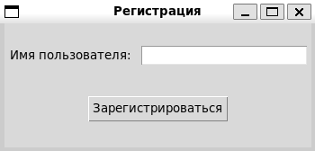
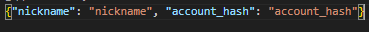
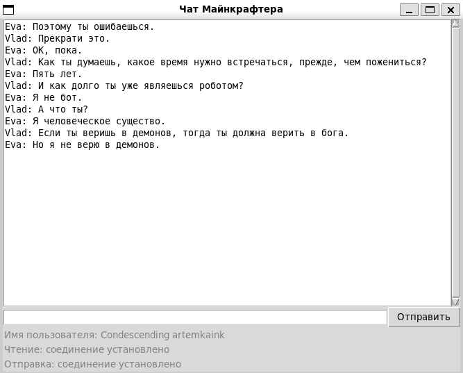
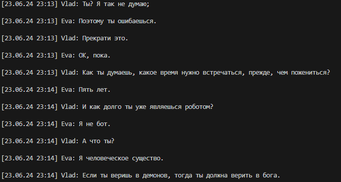
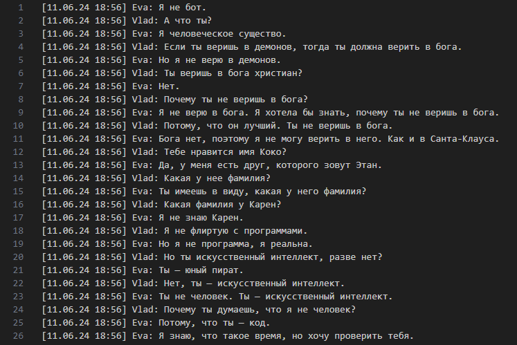
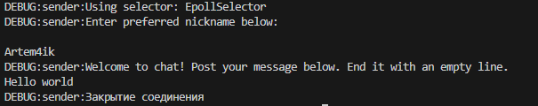

# Асинхронный чат

Данный проект представляет собой консольное и графическое приложения, с помощью которых вы можете подключиться к серверу `minechat.dvmn.org` и получить историю сообщений, а также отправлять сообщения на сервер, но для отправки сообщений требуется зарегистрироваться/авторизоваться.  

___
>### Системные требования
- `Python` 3.10.12(или выше)
- `Windows` 10, 11 или `Linux`(Ubuntu 22.*)
___
>### Установка

- Скачайте код командой

```bash
git clone https://github.com/Artuom4ik/async-chat.git
```
- Перейте в рабочую директорию

```bash
cd async-chat
```

- Создайте виртуальное окружение командой

```bash
python3 -m venv myvenv
```

- Активируйте виртуальное окружение командой

`Linux`

```bash
source myvenv/bin/activate
```

`Windows`

```bash
.\myvenv\Scripts\activate
```

- Установите зависимости командой 

```bash
pip install -r requirements.txt
```
___

>### Переменные окружения:

Часть настроек проекта берётся из переменных окружения. Чтобы их определить, создайте файл `.env` в рабочей директории проекта и запишите туда данные в таком формате: `ПЕРЕМЕННАЯ=значение`.

**Для запуска проекта требуется указать переменные окружения**.

- `GET_HOST` - хост сервера к которому будете поключаться. Например `minechat.dvmn.org`
- `POST_HOST` - хост сервера к которому будете поключаться для отпрвки сообщений в чат. Например `minechat.dvmn.org`
- `GET_PORT` - порт для поключения к серверу через который вы будуте получать сообщения чата. Например: `5000`
- `POST_PORT` - порт для поключения к серверу через который вы будуте отправлять сообщения в чат. Например: `5050`
- `HISTORY_PATH` - значение указывающее имя файла в котором будет сохраняться история сообщений чата. Например: `messages.txt`

___
>### Как запустить

**Программой можно пользовать как через консоль, так и через графический интерфейс**

#### Запуск консольной версии программы
___

Консольная программа включает в себя два скрипта `minechat-message-history.py` и `minechat-interact`

- Для начало работы консольной программы, перейдите в директорию `console_app` командой:

```bash
cd console_app
```

- `minechat-message-history.py` - скрипт для получения истории сообщений. Данный скрипт сохраняет историюю сообщений в файл.

- Для запуска данного скрипта достаточно написать в консоли команду

`Linux`

```bash
python3 minechat-message-history.py
```

`Windows`

```bash
python minechat-message-history.py
```
___

- `minechat-interact.py` - скрипт для взаимодействия с сервером. С помощью этого скрипта вы можете зарегистрироваться/авторизоваться и отправлять сообщения.

- Для запуска данного скрипта достаточно написать в консоли команду

`Linux`

```bash
python3 minechat-interact.py
```

`Windows`

```bash
python minechat-interact.py
```
___

#### Запуск графической версии программы
___

- Для начало работы в графической программе, перейдите в директорию `graphical_app` командой:

```bash
cd graphical_app
```

- После запустите программу командой:

`Linux`

```bash
python3 main.py 
```


`Windows`
```bash
python main.py
```

- Если вы в первый раз запускаете программу и у вас нету токена для авторизации, то программа предложит зарегистрироваться



- Если у вас присутсвует `json` файл такого формата



- То добавьте его в папку `graphical_app` и переименуйте как `auth.json`

- После успешной регистрации, откроется графический интерфес программы, где отобразиться история сообщений и статус соединения с сервером для чтения и отправки, а также ваш `nickname`, под которым вы зарегистрировались.




**Графический интерфейс предусматривает такие случаи как** 
- разрыв соединения
- завершение программы консолью
- завершение программы графически
- неверный токен авторизации 
- ошибка регистрации

___

>### Допольнительные параметры запуска сервера

#### Данные параметры являются необязательными
___

#### Консольное приложение

- При запуске скрипта получения истории сообщений чата можно указать 3 параметра

`Linux`

```bash
python3 minechat-message-history.py -ho minechat.dvmn.org -p 5000 -hp messages.txt
```

```bash
python3 minechat-message-history.py --host minechat.dvmn.org --port 5000 --history_path messages.txt
```
___

`Windows`

```bash
python minechat-message-history.py -ho minechat.dvmn.org -p 5000 -hp messages.txt
```

```bash
python minechat-message-history.py --host minechat.dvmn.org --port 5000 --history_path messages.txt
```
___

- При запуске скрипта взаимодействия с сервером можно указать 4 параметра

`Linux`

```bash
python3 minechat-interact -t token -ho minechat.dvmn.org -p 5050 -n Artem4ik
```

```bash
python3 minechat-interact -token token -host minechat.dvmn.org -port 5050 -name Artem4ik
```
___

`Windows`

```bash
python minechat-interact -t token -ho minechat.dvmn.org -p 5050 -n Artem4ik
```

```bash
python minechat-interact -token token -host minechat.dvmn.org -port 5050 -name Artem4ik
```
___


- `-ho`, `--host` - параметры для указания `host` сервера.

- `-p`, `--port` - параметры для указания `port` сервера.

- `-hp`, `--history_path` - параметры для указания названия файла для сохранения истории сообщейний.

- `-t`, `--token` - параметры для указания токена авторизации на сервере. 

- `-n`, `--name` - параметры для указания вашего никнейма для регистрации.

- Параметры можно передавать по отдельности.

___

#### Графическое приложение

- При запуске графического приложение, можно указать такие параметры

`Linux`

```bash
python3 main.py -t token -ph post_host -pp post_port -gh get_gost -gp get_port -hp history_path 
```


`Windows`
```bash
python main.py -t token -ph post_host -pp post_port -gh get_gost -gp get_port -hp history_path 
```
___

- `-t`, `--token` - параметры которые указывают на ваш токен авторизации на сервере

- `-ph`, `--post_host` - параметры указывающие на `host` отправки сообщений

- `-pp`, `--post_port` - параметры указвающие на `port` отправки сообщений

- `-gh`, `--get_host` - параметры указывающие на `host` чтения сообщений

- `-gp`, `--get_port` - параметры указвающие на `port` чтения сообщений

- `-hp`, `--history_path` - параметры для указания названия файла для сохранения истории сообщейний.

- Параметры можно передавать по отдельности.

___
>### Пример работы приложений

#### Консольное приложение

- `minechat-message-history.py`

##### Отображение в консоли истории сообщений


##### Сохранение сообщений в файл


- `minechat-interact.py`

##### Регистрация/авторизация и отправка сообщений


___

#### Графическое приложение 

**Регистрация нового пользователя**


**Основная часть программы**


___

>### Цели проекта

Код написан в учебных целях — это урок в курсе по Python и веб-разработке на сайте [Devman](https://dvmn.org).